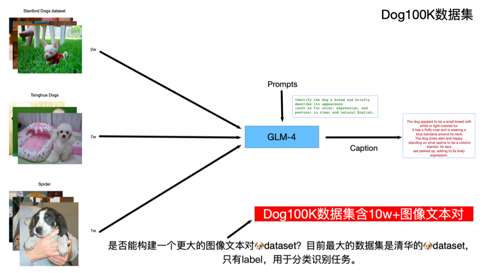

# Dog100K 数据集

Dog100K 是目前全网最大规模的高质量狗狗图文对齐数据集，包含超过 100,000 对图像与对应文本描述，专为图文检索、多模态学习、生成模型等任务设计。

  

---

🐶 **数据集亮点**

- 规模庞大：超过 10 万对图像与文本，覆盖丰富的狗狗品种、动作姿态和拍摄场景。  
- 标注精细：每张图片均配有自然语言描述，具备高准确性和丰富语义信息。  
- 多样性强：涵盖多种光照条件、背景类型和视角，增强模型泛化能力。  
- 开源共享：开放使用，支持学术研究和工业应用，推动跨模态 AI 发展。  

---

📂 **数据结构**

- `data/`  
  存放所有狗狗图像，命名格式为 `00000xxxx.jpg`。  

- `captions.csv`  
  图文对的索引文件，包含两列：  
  - `filename`：图像文件名  
  - `caption`：对应的文本描述  

---

🚀 **典型应用场景**

- **图文检索**（Image-Text Retrieval）  
  利用图像和文本的对应关系进行高效搜索。  

- **图像描述生成**（Image Captioning）  
  自动生成自然语言描述，提升图像理解。  

- **条件图像生成**  
  使用 DiT、Stable Diffusion、CogView3 等模型，基于文本生成逼真狗狗图像。  

- **多模态对比学习与跨模态理解**  
  适用于 Contrastive Learning、CLIP、BLIP 等框架，实现视觉与语言的深度融合。  

---

🔗 **数据集获取**

- **下载地址**（夸克网盘）：  
  👉 [点击这里下载](https://pan.quark.cn/s/847c986bb883)  

---
 
联系方式：[choucisan@gmail.com]  
